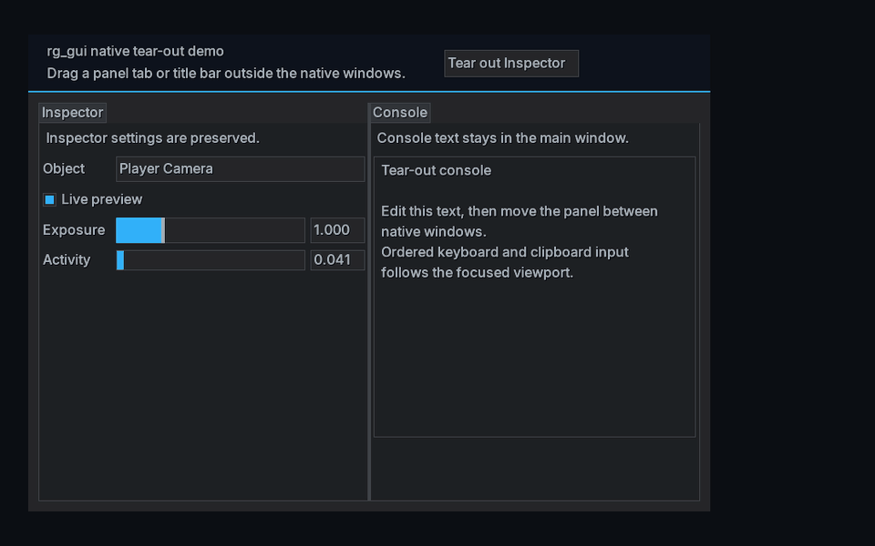
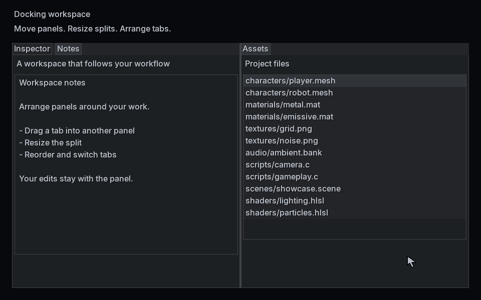
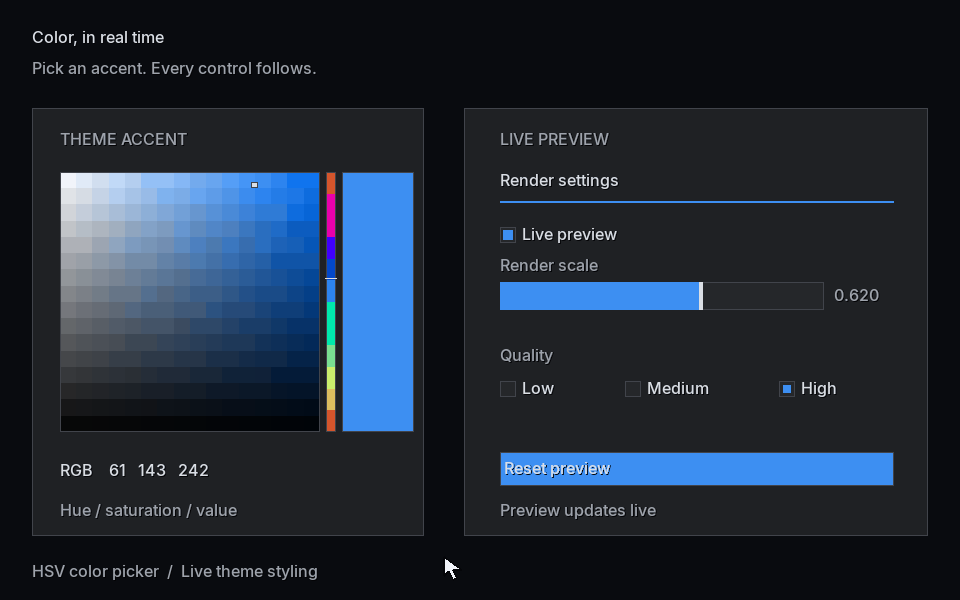
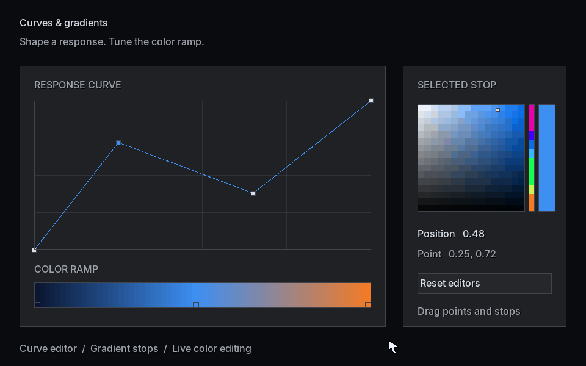
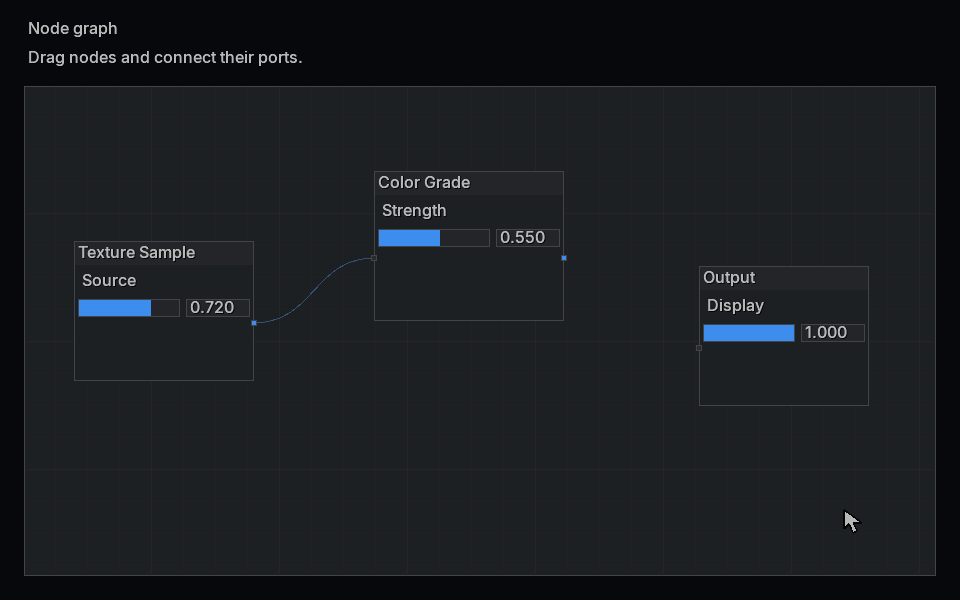

# rg_gui by Reverse Gravity

Immediate-mode C UI with docking, native viewports, persistent text caching,
and SDL3 GPU rendering.

`rg_gui` is currently a pre-1.0 library. The public API and serialized state
formats may change between 0.x releases; the [changelog](CHANGELOG.md) records
changes and compatibility notes.

The library depends directly on
[`rg_core`](https://github.com/superwendel/rg_core),
[`rg_text`](https://github.com/superwendel/rg_text), and SDL3. It provides the
frontend, persistent text preparation, and SDL3 GPU backend used by the example
applications in this repository.

## Feature previews

Move a docked panel into a separate native window and dock it again. The main
and detached windows' contents are shown together below.



<details>
<summary>Docking and split resizing</summary>

Rearrange tool panels and adjust the space between them.



</details>

<details>
<summary>Color picker and live theme changes</summary>

Choose a color and see the accent update across interactive controls.



</details>

<details>
<summary>Curve and gradient editing</summary>

Drag curve points and gradient stops to edit their values directly.



</details>

<details>
<summary>Node graph interactions</summary>

Move nodes and connect their ports to build a graph.



</details>

## Contents

- `src/rg_gui.h` - widgets, layout, interaction, docking, viewports, and ordered
  draw-list generation.
- `src/rg_gui_renderer.h` - persistent page-cached text preparation with
  32-glyph pages by default.
- `src/rg_gui_gpu.h` - SDL3 GPU rendering for rectangles, triangles, images,
  application-defined image materials, text, clipping, and draw-list order.
- `shaders/` - HLSL sources for the graphics and compute paths. Generated
  backend binaries are intentionally ignored.

The frontend uses `RgTextFont` directly for measurement. The renderer caches
`rg_text` glyph geometry and draws text, shapes, and stock images through an
ordered indexed stream. Compatible adjacent items share a draw call; text
vertices read the cached glyphs directly on the GPU. The steady-state frontend and
text-preparation paths use fixed-capacity storage selected at initialization;
they do not grow their arenas during a frame.

`rg_gui_init` requires a descriptor with a non-null font. Use
`rg_gui_memory_required` with that same descriptor to allocate the frontend
arena with sufficient capacity and alignment padding.

Changing text can opt into a shared `RgGuiTextLookup` through
`RgGuiInitDesc.text_lookup`. It costs about 65 KiB per font and accelerates ASCII
measurement. The renderer can borrow the same table via
`RgGuiRendererInitDesc.text_lookup`; use `rg_gui_renderer_memory_required_ex`
to omit its duplicate storage. The demos share one table per font. See the
[lookup ownership rules](docs/rg_gui.md#include-and-initialize).

Larger text editors can attach a caller-owned
[text-area layout cache](docs/rg_gui.md#persistent-text-area-layout) to reuse
wrapped lines across unchanged frames. The full showcase demonstrates it.

See [the API and integration notes](docs/rg_gui.md) for the complete lifecycle,
capacity behavior, platform output, and ownership rules.

## Dependencies

Use the latest `rg_core` and `rg_text` default branches, plus SDL3.
SDL_shadercross is required to compile the demo shaders. The demos include
prebuilt font assets, so no font-baking tools are needed.

No exact SDL3 release is enforced by the library or `build.bat`. You can use
your own compatible SDL3 installation. CI and the setup script select a tested
release for repeatable builds.

## Clean Windows setup

Install Visual Studio 2022 or later with the Desktop development with C++ workload and
open an **x64 Native Tools Command Prompt**. Keep the `rg_core` and `rg_text`
folders beside `rg_gui`, or set `RG_CORE_DIR` and `RG_TEXT_DIR` to their roots.

To install SDL3 and build SDL_shadercross without a package manager, run the
[Windows dependency setup script](.github/scripts/setup-windows-deps.ps1) in
PowerShell with CMake available:

```powershell
Set-ExecutionPolicy -Scope Process Bypass
./.github/scripts/setup-windows-deps.ps1 -Destination ./out/windows-deps
./build.bat test_ci
```

The script downloads the official SDL3 development package and shader compiler
dependencies, builds SDL_shadercross, and sets the paths for that PowerShell
session. CMake selects the installed Visual Studio version; use a CMake release
that supports your Visual Studio installation. SDL_shadercross currently has no
published release package.

If you already have SDL3 and SDL_shadercross installed, set their paths in the
x64 Native Tools Command Prompt instead:

```bat
set "SDL3_DIR=C:\path\to\SDL3"
set "SHADERCROSS_EXE=C:\path\to\SDL_shadercross\bin\shadercross.exe"
set "PATH=%SDL3_DIR%\lib\x64;%PATH%"
build.bat test_ci
```

Replace the example paths with your installation locations. `SDL3_DIR` should
contain `include\SDL3\SDL.h` and `lib\x64\SDL3.lib`; that `lib\x64` directory
also contains the runtime `SDL3.dll`. For custom layouts, set
`SDL3_INCLUDE_DIR`, `SDL3_LIB_DIR`, and `SDL3_BIN_DIR` explicitly. Keep
`shadercross.exe` and its runtime DLLs together in its `bin` directory.

## Build and test

From the `rg_gui` directory:

```bat
build.bat test
build.bat test_ci
build.bat shaders
build.bat test_gpu_device
build.bat test_demo_lifecycle
build.bat demo
build.bat demo_smoke
build.bat test_release
```

- `test` runs renderer-neutral and GPU-preparation tests without executing a GPU
  command buffer.
- `test_ci` also translates every shader format, validates demo assets, builds
  all demos, and compiles the GPU device and native lifecycle tests. It does
  not execute GPU work.
- `test_gpu_device` executes the hidden-window SDL_GPU device test.
- `test_demo_lifecycle` exercises native tear-out window reuse, restoration,
  text-input cleanup, and final destruction with actual SDL GPU windows.
- `demo_smoke` builds all three demos, briefly opens their windows, and requires
  three actual main-window presentations from each. The tear-out smoke also
  creates a secondary native window and presents its viewport at least once.
- `test_release` runs `test_ci`, the GPU device test, demo smoke tests, and
  native lifecycle checks. It requires a working SDL GPU device and display.

`build.bat clean` removes only generated files rooted in this checkout.

Use the [benchmark guide](benchmarks/README.md) for repeatable CPU comparisons
and the [profiling guide](benchmarks/PROFILING.md) to measure demo frame times
and renderer activity. See [performance against Dear ImGui](benchmarks/PERFORMANCE.md)
for workload comparisons, test settings, and tradeoffs.

## Demos

`build.bat demo` produces three examples using the checked-in Inter Medium
assets in `examples/assets`:

- `rg_gui_demo_minimal.exe` shows one movable window and a small set of controls
  in an end-to-end SDL3 GPU loop.
- `rg_gui_demo_full.exe` is a dockable showcase with menus, inspector widgets,
  plots, assets, hierarchy, notes, editors, and a node graph. Its View menu offers
  VSync, **Fast, no tearing** (Mailbox), and **Uncapped, may tear** (Immediate),
  with unsupported modes disabled. Frame Stats shows
  CPU stage timings, recent frame percentiles, draw calls, uploads, and text-cache counters.
- `rg_gui_demo_tearout.exe` demonstrates native multi-window viewports and
  moving docked panels between windows. It reuses one hidden native window to
  reduce close and reopen delays, releasing its resources at shutdown.

Run them with `build.bat run_demo_minimal`, `build.bat run_demo_full`, or
`build.bat run_demo_tearout`. `build.bat run_demo` aliases the full demo.
The full and tear-out demos default to VSync. Use `--present mailbox` for
tear-free presentation that allows rendering faster than the display refresh;
for example, `.\rg_gui_demo_full.exe --present mailbox`. Mailbox displays the
latest completed frame at refresh, so submitted frames can be replaced before
they become visible. `--present vsync` selects VSync; `--present immediate`
or its alias `--no-vsync` selects Immediate, which can tear. An unsupported
requested mode reports an error. `--start-torn-out` opens the tear-out demo's
secondary window. Every demo also
accepts `--smoke-test`, which briefly opens its windows, verifies swapchain
presentation, and exits. The tear-out smoke creates and renders its secondary
window as well. Use `--smoke-test` separately from `--profile`; smoke tests end
after only a few presented frames. See the [profiling guide](benchmarks/PROFILING.md)
for CSV capture, repeatable frame workloads, and interpreting the telemetry.

The demos compile with `/O2` and `NDEBUG` and use the portable C numeric
formatter. The live FPS display measures frame production; visible updates
also depend on the presentation mode and display refresh rate.

When deploying a demo, copy its two font assets and `shaders/Compiled` beside
it using the layouts described in [the asset notes](examples/assets/README.md)
and [the integration guide](docs/rg_gui.md). Demo shader lookup checks beside
the executable first and then the current working directory.

## Build model and platform status

The headers use internal linkage and are written for unity builds.
`rg_gui.h` intentionally has no include guard and emits a diagnostic if it is
included more than once in a translation unit. Include it once, normally
through `rg_gui_gpu.h` when using the SDL3 GPU renderer.

The tested language modes are C11 with MSVC and GNU11 with Clang. `rg_core`
uses compiler extensions for type-safe utility macros, so this stack does not
claim ISO C99 conformance.

| Platform | Build and runtime coverage |
| --- | --- |
| Windows x64 / MSVC | Full build, shader translation, demos, and local SDL_GPU device execution |
| Linux x64 / Clang | CI configured for ASan/UBSan host tests and GPU device-target compilation; GPU execution untested |
| macOS | Not currently tested; emitting MSL shader output is not a macOS support claim |

The demos build with portable C formatting. Projects that select rg_core's
optional native assembly formatter must also assemble and link its matching
helper object; see the [integration notes](docs/rg_gui.md).

## License and trademark

The software and documentation are available under the [MIT License](LICENSE).
The bundled Inter-derived demo font assets are licensed under the
[SIL Open Font License 1.1](examples/assets/LICENSE-INTER.txt). Trademark terms
are separate from the software license; see [TRADEMARKS.md](TRADEMARKS.md).
